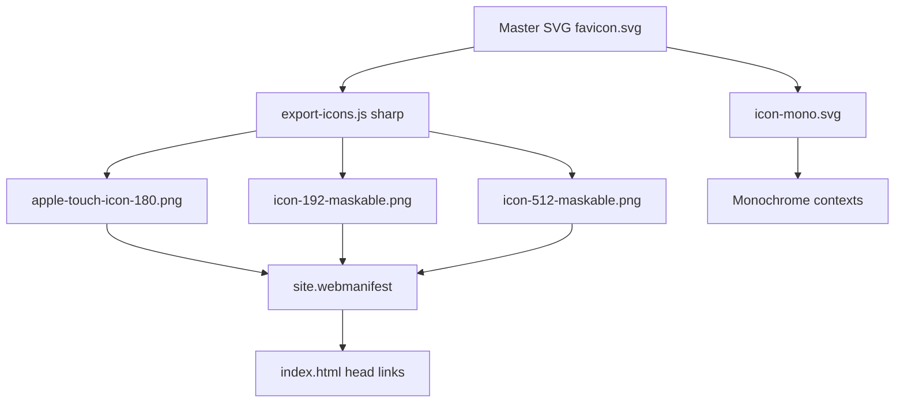

# GenFuture Brand Guidelines — Bold Youthful

Version 1.0

Purpose
Define a cohesive, professional visual identity for GenFuture that scales from favicon to in-product UI, aligned to the Bold Youthful direction selected.

Brand Essence
- Personality: bold, optimistic, guiding, youthful, trustworthy
- Concept: GenFuture as a compass that helps users navigate and achieve career goals
- Visual drivers: compass/guiding star, soft/long depth, rounded geometry radius 16, subtle gradients, high clarity

Core Palette
- Primary Purple: #7c3aed
- Accent Magenta: #db2777
- Secondary Indigo (supporting): #4f46e5
- Cyan Highlight (sparingly): #22d3ee
- Neutrals
  - Slate 900: #0f172a (primary text on light)
  - Slate 700: #334155
  - Slate 500: #64748b
  - Slate 300: #cbd5e1
  - Slate 100: #f1f5f9
  - White: #ffffff
- State colors (optional)
  - Success: #10b981
  - Warning: #f59e0b
  - Danger: #ef4444

Gradients
- Brand Gradient 1 (primary): linear 135deg, from #7c3aed to #db2777
- Brand Gradient 2 (support): linear 135deg, from #4f46e5 to #7c3aed
- Usage: sparingly for hero, icon fills, and highlight surfaces; maintain AA contrast on top text

Light and Dark
- Light theme background: #f8fafc
- Dark theme background: #0b1220 (near Slate 950), text on dark primarily #e2e8f0
- Meta theme-color (PWA)
  - Light: #7c3aed
  - Dark: #7c3aed (keep consistent for brand recognition)

Typography
- Headings: Outfit SemiBold (600), 700 for display
- UI and body: Inter (400–600)
- CSS font stacks
  - Outfit: "Outfit", Inter, system-ui, -apple-system, Segoe UI, Roboto, Helvetica, Arial, sans-serif
  - Inter: Inter, system-ui, -apple-system, Segoe UI, Roboto, Helvetica, Arial, sans-serif
- Recommended scale (rem)
  - Display: 3.0
  - H1: 2.25
  - H2: 1.875
  - H3: 1.5
  - Body-1: 1.0
  - Body-2: 0.875
- Line-height targets
  - Headings: 1.2–1.3
  - Body: 1.55–1.7
- Tracking
  - Headings: -0.01em to -0.02em
  - Body: 0 to 0.01em
- Guidance
  - Use Outfit for prominent titles, Inter for everything else to ensure system familiarity

Iconography System
- Master Mark: Compass + Guiding Star logomark
  - Outer form: circular field inside a rounded square container with radius 16 motif when used as app icon tiles
  - Safe-area: all essential geometry fits within 80% of the canvas for maskable icons
  - Rotation: 15° clockwise bias optional; default upright
  - Star: 8-point star centered, slight inner cut for depth, white fill
  - Compass needle: subtle path or chevron suggesting upward and forward motion
- Strokes and Cornering
  - Strokes: 2.5–3.5% of canvas width for internal lines at 1024 master
  - Round joins and caps where applicable
  - Maintain the radius 16 language for square tiles and UI containers
- Color in Icon
  - Background: Brand Gradient 1
  - Foreground: star and minor markers in white
  - Monochrome Variant: single-color slate or white for low-ink contexts

Master SVG Specifications
- Canvas: 1024 x 1024 (export downscales cleanly)
- Group layout
  - bg rounded rect (for app icon tiles)
  - inner circle field
  - gradient fill applied to inner field
  - guiding star shape
  - compass path
  - defs with gradient id brandGradient
- Naming
  - Master colorful icon: favicon.svg (scales for favicon and vector use)
  - Monochrome icon: icon-mono.svg (pure stroke/fill, no gradient)
- Accessibility
  - Title and desc elements present in SVG for assistive tech
  - Avoid tiny details below 2px at target sizes

Spacing and Layout
- Base unit: 4px grid
- Spacing scale (px): 4, 8, 12, 16, 24, 32, 40, 48, 64
- Shape language: radius 16 default on prominent surfaces; radius 12 for cards; radius 8 for inputs; radius 4 for chips
- Icon sizes in UI
  - xs 16, sm 20, md 24, lg 32, xl 48, 2xl 64
- In-component sizing: respect existing tokens in [const Logo = ({ size = 'medium' }) =>](frontend/src/components/Logo.jsx:3)

Shadows and Depth
- Style: soft/long with subtle color bleed
- Light theme CSS tokens
  - --elev-1: 0 4px 10px rgba(15, 23, 42, 0.06), 0 1px 0 rgba(15, 23, 42, 0.02)
  - --elev-2: 0 12px 24px rgba(15, 23, 42, 0.10), 0 4px 8px rgba(15, 23, 42, 0.06)
  - --elev-3: 0 24px 48px rgba(15, 23, 42, 0.14), 0 8px 16px rgba(15, 23, 42, 0.08)
- Dark theme CSS tokens
  - --elev-1: 0 6px 12px rgba(0, 0, 0, 0.35), 0 1px 0 rgba(255, 255, 255, 0.02)
  - --elev-2: 0 16px 32px rgba(0, 0, 0, 0.45), 0 4px 8px rgba(255, 255, 255, 0.03)
  - --elev-3: 0 32px 64px rgba(0, 0, 0, 0.55), 0 8px 16px rgba(255, 255, 255, 0.04)
- Do not overuse glow; prefer layered shadows with subtlety

Deliverables and File Map
- Vector
  - branding/master/favicon.svg
  - branding/master/icon-mono.svg
- Public runtime
  - [frontend/public/favicon.svg](frontend/public/favicon.svg)
  - [frontend/public/icon-mono.svg](frontend/public/icon-mono.svg)
  - [frontend/public/apple-touch-icon-180.png](frontend/public/apple-touch-icon-180.png)
  - [frontend/public/icon-192-maskable.png](frontend/public/icon-192-maskable.png)
  - [frontend/public/icon-512-maskable.png](frontend/public/icon-512-maskable.png)
  - [frontend/public/site.webmanifest](frontend/public/site.webmanifest)

App Integration
- HTML head references in [frontend/index.html](frontend/index.html)
  - Replace existing vite.svg with /favicon.svg
  - Add apple-touch-icon link
  - Add link rel manifest to /site.webmanifest
  - Add meta theme-color #7c3aed
- React component
  - Replace inline logo mark in [const Logo = ({ size = 'medium' }) =>](frontend/src/components/Logo.jsx:3) with the new compass star geometry and gradient
- Remove legacy
  - Deprecate [frontend/public/vite.svg](frontend/public/vite.svg) after integration

PWA Manifest
- Path: [frontend/public/site.webmanifest](frontend/public/site.webmanifest)
- Suggested fields
  - name: GenFuture Career
  - short_name: GenFuture
  - theme_color: #7c3aed
  - background_color: #0b1220
  - display: standalone
  - icons
    - icon-192-maskable.png with purpose maskable any
    - icon-512-maskable.png with purpose maskable any

Export Pipeline
- Script: [frontend/scripts/export-icons.js](frontend/scripts/export-icons.js)
  - Uses sharp to rasterize favicon.svg into:
    - apple-touch-icon-180.png (transparent or brand background)
    - icon-192-maskable.png (with 10% padding, circles centered)
    - icon-512-maskable.png (same padding rule)
  - Enforces pixel-perfect 1px minimum stroke at raster sizes
- NPM integration in [frontend/package.json](frontend/package.json)
  - "export:icons": node ./scripts/export-icons.js
  - "postinstall": npm run export:icons

Testing and QA
- Favicon
  - Verify display in multiple tabs, light and dark theme OS settings
- PWA
  - Chrome Application tab: verify icons and maskable preview framing
- Contrast
  - White star over gradient must meet 3:1 perceived contrast at 24px and larger
- Scaling
  - At 16px, icon remains recognizable; avoid thin interior lines

Do and Don’t
- Do
  - Keep gradients subtle and smooth
  - Maintain radius 16 language on tiles and key surfaces
  - Use Outfit for headings, Inter for UI
- Don’t
  - Over-rotate the compass beyond 20°
  - Add outlines around the star on small sizes
  - Place vibrant gradients behind long paragraphs

Reference SVG Blueprint
Use the following structure when implementing the master icon (geometry will be implemented in code):

```svg
<svg viewBox="0 0 1024 1024" fill="none" xmlns="http://www.w3.org/2000/svg">
  <title>GenFuture Icon</title>
  <desc>Compass and guiding star symbolizing navigation and achievement</desc>

  <defs>
    <linearGradient id="brandGradient" x1="0" y1="0" x2="1" y2="1">
      <stop offset="0%" stop-color="#7c3aed"/>
      <stop offset="100%" stop-color="#db2777"/>
    </linearGradient>
  </defs>

  <g>
    <rect x="64" y="64" width="896" height="896" rx="160" ry="160" fill="#0b1220" opacity="0"/>
    <circle cx="512" cy="512" r="448" fill="url(#brandGradient)"/>

    <!-- Guiding star -->
    <path d="M512 300 L540 420 L660 420 L568 488 L596 608 L512 536 L428 608 L456 488 L364 420 L484 420 Z"
          fill="#ffffff"/>

    <!-- Compass upward path -->
    <path d="M320 672 Q512 420 704 672" stroke="#ffffff" stroke-width="28" stroke-linecap="round" fill="none" opacity="0.95"/>
    <circle cx="432" cy="592" r="14" fill="#ffffff" opacity="0.9"/>
    <circle cx="512" cy="512" r="14" fill="#ffffff" opacity="0.95"/>
    <circle cx="592" cy="592" r="14" fill="#ffffff" opacity="0.9"/>
  </g>
</svg>
```

Asset Pipeline Diagram



Implementation Plan Snapshot
- Author master vectors under branding/master, copy to [frontend/public](frontend/public:1)
- Add PWA manifest [frontend/public/site.webmanifest](frontend/public/site.webmanifest)
- Wire head tags in [frontend/index.html](frontend/index.html)
- Update [const Logo = ({ size = 'medium' }) =>](frontend/src/components/Logo.jsx:3) geometry to match master
- Remove [frontend/public/vite.svg](frontend/public/vite.svg) reference

Notes
- Ensure Google Fonts import or local bundling for Outfit and Inter before rollout
- Keep iterations under source control; commit master SVG separately for design audit